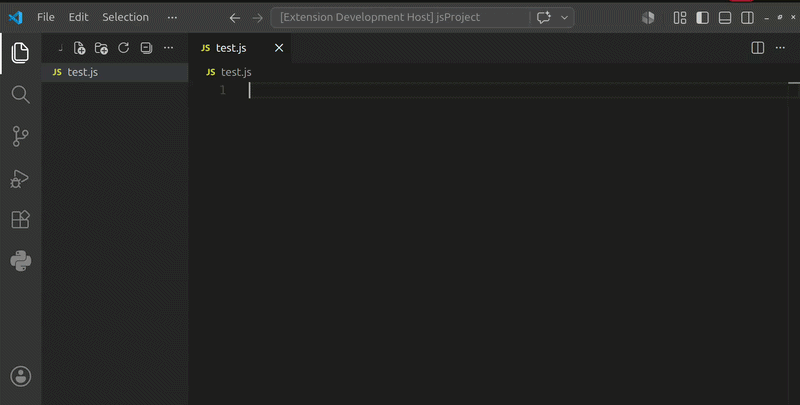

# Live Code Replay README

Live Code Replay is a Visual Studio Code extension that simulates real-time code typing inside the editor. It is designed for coding tutorials, live demonstrations, presentations, classroom instruction, and content creation where code needs to appear as if it is being typed naturally.

The extension supports configurable typing speed, replaying code from relative or absolute file paths, and pause/resume controls for smooth demonstrations.

---

## Features

* Replay source code as realistic typing animations.
* Support for both relative and absolute file paths.
* Configurable typing speed.
* Pause and resume replay at any time.
* Continue replay from the exact position where it was paused.
* Simple keyboard shortcuts for quick control.
* Replay code directly into the active editor.

### Commands

| Command                  | Description            |
| ------------------------ | ---------------------- |
| Live Code Replay: Start  | Start code replay      |
| Live Code Replay: Pause  | Pause an active replay |
| Live Code Replay: Resume | Resume a paused replay |

### Default Shortcuts

| Action | Shortcut       |
| ------ | -------------- |
| Start  | Ctrl + Alt + S |
| Pause  | Ctrl + Alt + P |
| Resume | Ctrl + Alt + R |

### Screenshots / GIFs

Add screenshots or GIFs to demonstrate the extension in action.

Example:

```markdown

```

> Tip: A short GIF showing a replay session, pause, and resume sequence can significantly improve Marketplace engagement.

---

## Requirements

### Visual Studio Code

This extension requires:

* VS Code 1.120.0 or later

### No Additional Dependencies

Live Code Replay works out of the box after installation and does not require any external tools or runtimes.

---

## Extension Settings

This extension contributes the following settings:

### `liveReplay.speed`

Controls typing speed in characters per second.

Default:

```json
"liveReplay.speed": 50
```

### `liveReplay.sourceFile`

Specifies the source file used for replay.

Supports:

* Relative paths from the workspace root
* Absolute paths anywhere on the system

Default:

```json
"liveReplay.sourceFile": ""
```

Linux/macOS example:

```json
"liveReplay.sourceFile": "/home/user/projects/demo.py"
```

Windows example:

```json
"liveReplay.sourceFile": "C:\\Users\\User\\Desktop\\demo.py"
```

### `liveReplay.startLine`

Defines the line number where replay should begin.

Default:

```json
"liveReplay.startLine": 0
```

### `liveReplay.sourceSkipLine`

Skips a specified number of lines from the source file before replay starts.

Default:

```json
"liveReplay.sourceSkipLine": 0
```

---

## Usage

### Replay From a Configured Source File

1. Open the file where code should be typed.
2. Configure `liveReplay.sourceFile`.
3. Run **Live Code Replay: Start** from the Command Palette.
4. The extension begins typing into the active editor.

### Replay the Current File

If no source file is configured:

1. Open a saved source file.
2. Run **Live Code Replay: Start**.
3. A new editor opens beside the current file.
4. The extension replays the contents automatically.

### Pause and Resume

While replay is running:

* Execute **Live Code Replay: Pause** to pause typing.
* Execute **Live Code Replay: Resume** to continue.

Replay resumes from the exact character where it was paused.

---

## Known Issues

* Only one replay session can run at a time.
* The destination editor must remain open during replay.
* Very large source files may take longer to complete depending on the configured typing speed.

If you encounter any issues, please report them through the project repository.

---

## Release Notes

### 0.0.1

Initial release of Live Code Replay.

Features included:

* Code replay functionality
* Relative path support
* Absolute path support
* Configurable typing speed
* Pause functionality
* Resume functionality
* Keyboard shortcuts

---

## Following Extension Guidelines

Ensure that you've read through the VS Code Extension Guidelines and follow best practices for extension development.

* https://code.visualstudio.com/api/references/extension-guidelines

---

## For More Information

* https://code.visualstudio.com/docs
* https://code.visualstudio.com/api
* https://www.markdownguide.org/basic-syntax/

---

**Enjoy using Live Code Replay!**
